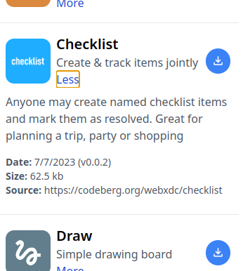

  
Others are hand-wavingly chattering about so called "super-app" or "everything app" architectures, 
but we prefer to just [deliver](https://delta.chat/en/2022-06-14-webxdcintro)
and [improve](http://delta.chat/en/2023-06-28-webxdc-import-export) them.
Today, we are happy to announce a new way to **find and start** 
[webxdc "everything" apps](https://webxdc.org), among them: 

- A Wordle/Reactle clone, 2048, and other fun games,

- calendar, poll and checklist tools,

- a first editor app – think Cryptpad but without servers. 

[Rest-assured](https://delta.chat/en/2023-05-22-webxdc-security), 
nobody else than your chat partners will know 
that you are running an app together.
There is no server or app-specific hosting and
not even the app developer or the xstore bot can track what you do. 
All app interactions are automatically **end-to-encrypted
and offline-first**: they all safely work in bad or no-network situations. 
Let's take the open web of streets back from the online-platform billionaires 😊

  

## How to start

  
With Delta Chat already working it's dead simple to **start**:

1. Say "hi" to [xstore@testrun.org](mailto:xstore@testrun.org?body=hi)
   and hit **Start** on the returned webxdc store app. 

2. Select a game or collaborative app for download.

3. Share the downloaded app to a chat so that all members 
   can **Start** the app without any logins, cookie or GDPR screens.

⚠️  Note that if your version of Delta Chat is older than 1.38,
the store app will not work properly;
you can not share downloaded webxdc apps to a chat then.
[Just upgrade your Delta Chat app](download)
to make it work.

### I don't have Delta Chat yet, how can I play with this?  {#tryout}

[Install Delta Chat](https://get.delta.chat) and in the setup-screen 
scan this invitation code to get an instant e-mail test account: 

The test e-mail account will only exist 90 days
and it does not allow to send chat mails to most "outside" e-mail addresses. 
But if you want to test things for yourself,
just share apps with your "Saved Messages" chat to play
the occassional game without any ads or tracking. 
Or maybe also use the "add second device" feature 
to try out a cheap method of safely syncing notes, 
checklists or calendars between your devices
without any servers or additional accounts. 

## How can I submit my own webxdc app to xstore?

It is easy to adjust web apps
so they work as webxdc apps in Delta Chat.
And by exchanging updates between different Delta Chat users,
you can make them collaborative.

To get started with development,
take a look [at the docs](https://docs.webxdc.org/).
You can also take other webxdc apps as an example;
in xstore you can find links to any app's source code
by clicking on "More":

If you want to make your own webxdc app available in xstore,
just go on [codeberg.org](https://codeberg.org/webxdc/xdcget)
(a github alternative)
and open a pull request to our xdcget config file,
like [in this example](https://codeberg.org/webxdc/xdcget/pulls/50).
It's works basically like in F-Droid,
just with much less complexity.

If you submit an app,
we'll send you "delta chat" and "webxdc" stickers by postal mail,
and also provide an account token
for giving out fully functional chat-mail accounts
(not restricted like on @try.webxdc.org)
to five friends or family.

We are looking forward to your contributions,
and hope you have fun with webxdc apps in Delta Chat!

## How does xstore work? Where does it get its apps from? 

  
[xstore@testrun.org](mailto:xstore@testrun.org?body=hi) is a chat bot instance.
After you send “Hi” to the bot,
you receive and start the store app,
which continues to communicate with the bot
for selecting and downloading apps.
You can not share the store app
to another chat.
That’s because
webxdc apps can not access the Internet,
only the bot.

If it was a website,
you could say
the store app is the frontend,
the store bot is the backend.

The xstore chat bot
collects webxdc apps from a list of “git” repository sources
and will continously offer the latest released app versions.
You can also self-host the store bot:
checkout installation instructions
in the [bot’s codeberg repository](https://codeberg.org/webxdc/store/).
It works well together with [xdcget](https://codeberg.org/webxdc/xdcget/),
a command line tool
which downloads webxdc releases
from git public repositories. 

### Important Notes:

- If you deleted the store or
  chose "clear chat" to clean up,
  you can at any point in time just send "hi"
  to [xstore@testrun.org](mailto:xstore@testrun.org?body=hi) again,
  and it will re-send the store to the chat.
- Only one chat member needs to use xstore@testrun.org while
all others can just start the app they receive in the chat, 
and everyone can forward apps to other chats without restrictions,
and without any kind of central tracking. 
- If you use the XMPP messenger cheogram,
  xstore will not work for you yet;
  but with upcoming support for webxdc in XMPP/e-mail bridges
  you might be able to message [xstore@testrun.org](mailto:xstore@testrun.org?body=hi)
  and download apps from there.

  
This project was made possible
through the funding and support
of the [NGI0 Entrust Fund](https://nlnet.nl/entrust),
a fund established by [NLnet](https://nlnet.nl/)
with financial support
from the European Commission's [Next Generation Internet](https://ngi.eu/) programme.
Thank you very much for this opportunity!

